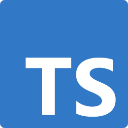
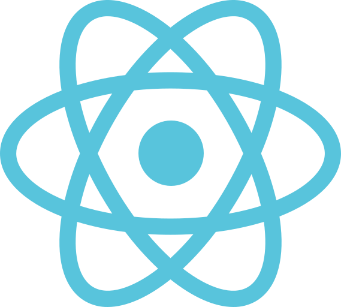
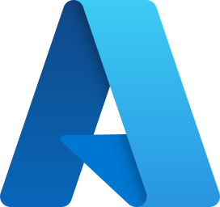

# Ben Mombouli

AI Product Engineer building practical, scalable, and user-focused software.

I design and ship solutions at the intersection of **applied AI**, **software engineering**, and **cloud infrastructure**.

## Highlights

## Tech Stack

  
  
  
  
  
  
  

## Current Focus

- Building AI-powered products and developer tools
- Creating automation workflows and cloud-native systems
- Delivering clean product experiences with strong UX thinking

## Contact

- LinkedIn: https://linkedin.com/in/ben-mombouli
- GitHub: https://github.com/HackerGit29
- Email: benji-akadev@outlook.fr
